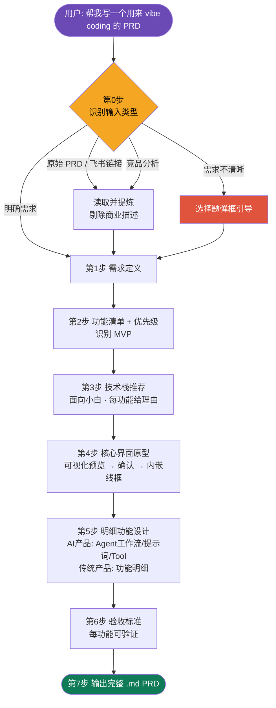

<div align="center">

# 🧭 vibe-coding-prd

**把杂乱的原始素材，提炼成可以直接丢给 Claude Code / Codex 开工的工程化 PRD。**

从「一句模糊的想法 / 给人看的原始 PRD / 竞品分析」→「面向编码 Agent、可直接开工的 PRD」。

<br/>


</div>

---

## ✨ 它解决什么问题

技术小白脑子里的需求是**模糊**的，而编码 Agent 需要的是**明确、无歧义**的输入。这中间的鸿沟不能靠"猜"来填——猜错一个方向，编码 Agent 就会写出一大堆错的代码。

`vibe-coding-prd` 就是这座桥：它**一步步和你确认**，把原始素材转成结构清晰、每个功能都有可验证验收标准的 PRD。

| 输入 | 处理 | 输出 |
|------|------|------|
| 明确需求 / 原始 PRD / 竞品分析 / 一句想法 / 飞书链接 | 分类 → 提炼 → 分步弹框确认 → 可视化原型 | 一份中文 `.md` PRD，编码 Agent 拿到就能开工 |

---

## 🔩 三条硬纪律

> 这三条是 skill 的灵魂，也是它和"直接让 AI 写个 PRD"的本质区别。

- 🙅 **不推断，用弹框确认** —— 凡涉及"你到底想要什么"的判断，都停下来让你拍板。可以给推荐草案，但不替你定死。
- ✂️ **精简，不写黑话** —— PRD 是给编码 Agent 看的，不是给投资人看的。删掉"商业价值 / 市场空间 / ROI"。
- ✅ **验收标准必须可验证** —— 每条都要能用"是/否"核对（"点了 X 出现 Y"），禁止"体验流畅"这类空话。

---

## 🗺️ 工作流程



每一步结束都用**弹框**和你确认后再进入下一步，绝不一口气跑完。

---

## 📦 产出的 PRD 长什么样

一份完整 PRD 包含这些部分（详见 [`references/prd-template.md`](references/prd-template.md)）：

```
0. 一句话概述
1. 需求定义            —— 给谁 / 什么场景 / 解决什么问题 / 产品形态
2. 功能清单            —— 一级模块 · 二级功能 · 优先级 · MVP 标记
3. 技术栈              —— 每层推荐技术 + 小白能懂的理由
4. 核心界面原型        —— ASCII 线框图（可视化预览确认后内嵌）
5. 明细功能设计        —— AI 产品出 Agent 工作流/提示词/Tool；传统产品出功能明细
6. 验收标准            —— 每功能可"是/否"核对
7. 非目标 / 暂不做
8. 给编码 Agent 的启动说明
```

---

## 🚀 安装

### 装到当前项目（只在这个项目生效）

```bash
mkdir -p .claude/skills
git clone https://github.com/GT0698/vibe-coding-prd.git .claude/skills/vibe-coding-prd
```

### 装到全局（所有项目可用）

```bash
git clone https://github.com/GT0698/vibe-coding-prd.git ~/.claude/skills/vibe-coding-prd
```

> 安装后可能需要**新开一个 Claude Code 会话**才会加载。

---

## 💬 怎么用

在 Claude Code / Codex 里直接说触发语，并附上你的素材：

```
帮我写一个用来 vibe coding 的 PRD
<粘贴你的需求 / 原始 PRD / 竞品分析，或一个飞书文档链接>
```

也不必非说"vibe coding"四个字——凡是想把模糊想法或面向人的文档，转成面向编码 Agent 的可开工 PRD，都会触发。

---

## 📁 仓库结构

```
vibe-coding-prd/
├── SKILL.md                        # 触发描述 + 三条纪律 + 0→7 步工作流 + 弹框规范
├── README.md
└── references/
    ├── prd-template.md             # 最终输出的完整 PRD 骨架
    ├── tech-stack-guide.md         # 面向小白的技术选型思路 + 常见产品推荐栈
    └── wireframe-guide.md          # 原型图：可视化预览 → 内嵌 ASCII 线框
```

---

<div align="center">
<sub>用 <a href="https://claude.com/claude-code">Claude Code</a> 的 skill-creator 打造 · 一份好 PRD，是 vibe coding 成功的一半</sub>
</div>
